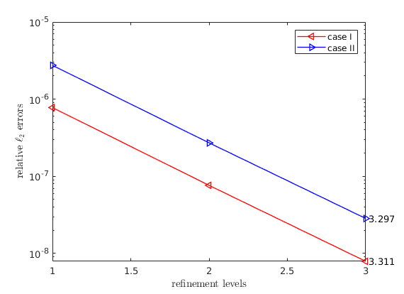

.. include:: links.txt

.. _unifem:

``UNIFEM`` Extension
====================

Although the `modified moving least square` in `DTK2`_ is a very advanced
data remapping method, there are still rooms for improvement.

1.

    Whenever dealing with Vandermonde systems, stability must be taken into
    consideration.

2.

    The local support of the Vandermonde systems should be adaptive based on
    the properties of local stencils.

The MLS method solves the local problem in the normal equation setting, which
doubles the condition number of the system. MMLS solves the local system with
*truncated singular value decomposition* (TSVD), but the problem is that the
truncated terms in the Vandermonde systems cannot be controlled. Notice that
in order to perform the TSVD, an condition number estimator is needed, and MMLS
uses the one in LAPACK for general matrices that requires an LU factorization,
which takes another :math:`O(n^3)` FLOPs.

Regarding implementation details, MMLS uses the global cartesian coordinates
for constructing Vandermonde matrices and calls SVD incrementally to ensure
the resulting systems are full rank, and this procedure is less stable and
costly.

For the local stencil choice, directly using the query results is risky,
because the stencil might be too large. In general, the number of points in
the local stencils should be determined by the column sizes of the Vandermonde
systems.

Moreover, after the data has been remapped, an intermediate target solutions
are obtained. Combining with the input source data, *a posteriori* error
analysis can be performed in order to fix non-smooth values.

With these considerations, we have implemented *adaptive weighted least square*
(AWLS) as an extension of the **meshless** methods in `DTK2`_.

.. _wls:

Weighted Least Square (WLS) Formulation
---------------------------------------

Formulation
+++++++++++

Given the source input discrete function values :math:`\boldsymbol{f}^s` and
target output :math:`\boldsymbol{f}^t`, we want to construct a
*transfer operator* :math:`\boldsymbol{T}`, s.t.

.. math::
    :label: op

    \boldsymbol{f}^t&=\boldsymbol{T}\cdot\boldsymbol{f}^s

Clearly, such an operator is rectangle with sizes :math:`n` by :math:`m`, where
:math:`n` is the number of nodes in target grid while :math:`m` for that of
the source grid.

Therefore, for each target node :math:`i`, we have an "interpolation" that
reads:

.. math::
    :label: it

    f_i^t&=T_{i,\boldsymbol{J}}\cdot\boldsymbol{f}_{\boldsymbol{J}}^s

where :math:`\boldsymbol{J}` is the local support stencil around target node
:math:`i`. Denote :math:`\boldsymbol{c}^T=T_{i,\boldsymbol{J}}`, and localize
the stencil :math:`\boldsymbol{J}` around the target node
:math:`\boldsymbol{x}_i` and denote the localized stencil to be
:math:`\boldsymbol{u}`, i.e.
:math:`\boldsymbol{u}=\boldsymbol{x}-\boldsymbol{x}_i`, we can then build the
*generalized Vandermonde system* (assume 2D):

.. math::
    :label: v

    \boldsymbol{V}&=
        \left\vert
        \begin{array}{*{6}{c}}
            \boldsymbol{1} & \boldsymbol{u}_1 & \boldsymbol{u}_2 & \boldsymbol{u}_1^2 & \boldsymbol{u}_1\boldsymbol{u}_2 & \boldsymbol{u}_2^2 \\
        \end{array}
        \right\vert

So the coefficients :math:`\boldsymbol{c}^T` can be solved with the following
fitting problem:

.. math::
    :label: fit

    \boldsymbol{V}^T\cdot\boldsymbol{c}&=\boldsymbol{e}_1

If :math:`\boldsymbol{V}` is square system, i.e. typical Vandermonde system,
then :eq:`fit` is just an interpolation problem. When we have more points than
the number of columns in :math:`\boldsymbol{V}`, it results a rectangle
system thus requiring least square minimization.

Note that a more intuitive derivation of :eq:`fit` is to first form a system of
polynomial coefficients for :math:`\boldsymbol{J}` and explicitly compute the
values of any points in :math:`\boldsymbol{u}`.

.. math::
    :nowrap:
    :label: fit2

    \begin{eqnarray*}
    \boldsymbol{V}\cdot\boldsymbol{C}&=\boldsymbol{I} \\
    \boldsymbol{C}&=\boldsymbol{V}^+
    \end{eqnarray*}

Where :math:`\boldsymbol{V}^+` is the *pseudo-inverse* of
:math:`\boldsymbol{V}`. Given a point :math:`\boldsymbol{p}` in the local
coordinate system :math:`\boldsymbol{u}`, its Vandermonde component is:

.. math::
    :label: vc

    \boldsymbol{p}_V&=[1\ p_1\ p_2\ p_1^2\ p_1p_2\ p_2^2]^T

Then evaluating :eq:`vc` in the system of polynomial coefficients, i.e.
:eq:`fit2`, is just to perform :math:`\boldsymbol{p}_V^T\cdot\boldsymbol{C}`.
It's worth noting that for the fitting problem, where the query point is always
the center (the target node of interest) thus having the the Vandermonde
component :math:`[1\ 0\ 0\ 0\ 0\ 0]^T`. Therefore, the explicit computation
reduces to :eq:`fit`.

It is well-known that the Vandermonde systems are ill-conditioned, so a
balancing technique is needed. A typical way is to do a column scaling:
:math:`\boldsymbol{V}\cdot\boldsymbol{S}`. Typical choices of the diagonal
matrix :math:`\boldsymbol{S}` are 1) *algebraic scaling* that is based on the
norms of column vectors of :math:`\boldsymbol{V}` and 2) *geometric scaling*
that is based on the radii of the local stencil :math:`\boldsymbol{J}`. Here
we choose the latter, and the local stencil radii is chosen as:

.. math::
    :label: radii

    r&=\max\limits_{j\in\boldsymbol{J}}(\max\limits_{1\le d\le D}(\left\vert\boldsymbol{u}_d^j\right\vert))

Where :math:`D` is the spatial dimension. Then the column scaling matrix is
(assume 2D):

.. math::
    :label: s

    \boldsymbol{S}&=
        \left\vert
        \begin{array}{*{6}{c}}
            1 & 0 & 0 & 0 & 0 & 0 \\
            0 & 1/r & 0 & 0 & 0 & 0 \\
            0 & 0 & 1/r & 0 & 0 & 0 \\
            0 & 0 & 0 & 1/r^2 & 0 & 0 \\
            0 & 0 & 0 & 0 & 1/r^2 & 0 \\
            0 & 0 & 0 & 0 & 0 & 1/r^2 \\
        \end{array}
        \right\vert

.. note:: :math:`\boldsymbol{S}` doesn't affect the solution.

Now, the least square problem :eq:`fit2` can be formulated as:

.. math::
    :label: min

    \min(\left\Vert\boldsymbol{V}\cdot\boldsymbol{C}-\boldsymbol{I}\right\Vert_{\boldsymbol{W}})

We choose to use the family of *radius basis functions* (RBF) as the diagonal
row weighting matrix :math:`\boldsymbol{W}`.

.. note:: :math:`\boldsymbol{W}` **does** affect the solution.

With :eq:`s` and :eq:`min`, we have a weighted and balanced generalized
Vandermonde system:

.. math::
    :label: vv

    \hat{\boldsymbol{V}}&=\boldsymbol{W}\cdot\boldsymbol{V}\cdot\boldsymbol{S}

Plug :eq:`vv` into :eq:`fit` and reorganize it, we have:

.. math::
    :nowrap:
    :label: fit-final

    \begin{eqnarray*}
    \hat{\boldsymbol{V}}^T\cdot\boldsymbol{W}^{-1}\cdot\boldsymbol{c}&=\boldsymbol{S}^{-1}\cdot\boldsymbol{e}_1 \\
    \hat{\boldsymbol{V}}^T\cdot\hat{\boldsymbol{c}}&=\boldsymbol{e}_1
    \end{eqnarray*}

Where :math:`\hat{\boldsymbol{c}}=\boldsymbol{W}^{-1}\cdot\boldsymbol{c}`.

Solving WLS
+++++++++++

We follow the technique of using *truncated QR with column pivoting* (TQRCP)
introduced here [#]_ to solve the problem :eq:`fit-final`.

The first step is to decompose :math:`\hat{\boldsymbol{V}}` with QRCP:

.. math::
    :label: qrcp

    \hat{\boldsymbol{V}}\cdot\boldsymbol{P}&=\boldsymbol{Q}\cdot\boldsymbol{R}

The truncation step is to utilize a condition number estimator for the upper
triangular system :math:`\boldsymbol{R}` that will report the rank of the
system---:math:`k`. Combine this with :eq:`qrcp` and plug into :eq:`fit-final`,
we have:

.. math::
    :nowrap:
    :label: solve

    \begin{eqnarray*}
    \boldsymbol{P}_{:,1:k}\cdot\boldsymbol{R}_{1:k,1:k}^T\cdot\boldsymbol{Q}_{:,1:k}^T\cdot\hat{\boldsymbol{c}}&=\boldsymbol{e}_1 \\
    \boldsymbol{R}_{1:k,1:k}^T\cdot\boldsymbol{Q}_{:,1:k}^T\cdot\hat{\boldsymbol{c}}&=\boldsymbol{P}_{:,1:k}^T\cdot\boldsymbol{e}_1 \\
    \boldsymbol{Q}_{:,1:k}^T\cdot\hat{\boldsymbol{c}}&=\boldsymbol{R}_{1:k,1:k}^{-T}\cdot\boldsymbol{P}_{:,1:k}^T\cdot\boldsymbol{e}_1 \\
    \hat{\boldsymbol{c}}&=\boldsymbol{Q}_{:,1:k}\cdot\boldsymbol{R}_{1:k,1:k}^{-T}\cdot\boldsymbol{P}_{:,1:k}^T\cdot\boldsymbol{e}_1 \\
    \boldsymbol{c}&=\boldsymbol{W}\cdot\boldsymbol{Q}_{:,1:k}\cdot\boldsymbol{R}_{1:k,1:k}^{-T}\cdot\boldsymbol{P}_{:,1:k}^T\cdot\boldsymbol{e}_1
    \end{eqnarray*}

This procedure is very efficient and robust. The dominated computation cost
comes from QRCP, i.e. :math:`O(n^3)`, where :math:`n` is some measure of the
size of local problems. It's worth noting that QRCP is called only once
for each of the local problems.

.. [#]

    R. Conley, T. J. Delaney, and X. Jiao. Overcoming element quality
    dependence of finite elements with adaptive extended stencil FEM (AES-FEM).
    Int. J. Numer. Meth. Engrg., vol. 108, pp. 1054–1085, 2016.

.. _unifem_local_stencil:

Improving the Strategy of Choosing Local Stencil
------------------------------------------------

The original `DTK2`_ stencil choice is based on a global configuration
parameter of either ``knn`` (k nearest neighborhoods) or ``radius``. Moreover,
the resulting neighbors are used to be the support of the local problems, i.e.
number of points used in the Vandermonde systems. This procedure is not robust
for problems with point clouds that are not uniformly distributed. To overcome
this, we have implemented the following three steps for querying and choosing
local supports.

1.

    Perform ``knn`` search with a small number of neighborhoods to estimate the
    radii of the one-ring neighborhood of the local point clouds, say
    :math:`h`.

2.

    Perform ``radius`` search with a relatively large radius so that we have
    enough candidates for next step. The radius is chosen as: :math:`r=ah`.

3.

    Choose the support stencil, i.e. :math:`\boldsymbol{J}` from the candidates
    based on the number of columns (coefficients) in the Vandermonde systems,
    i.e. :math:`\left\vert\boldsymbol{J}\right\vert=\rho c_d`. Notice that
    :math:`c_d` are 3, 6, and 10 for dimension (subscript :math:`d`) 1, 2,
    and 3 for quadratic polynomial basis functions, respectively.

.. note::

    We choose :math:`a=5` for candidate selections and observe that better
    results can be obtained with :math:`\rho\approx 3`.

.. note::

    Theoretically, steps 1 and 2 can be achieved with ``knn`` search if we can
    determine the number points in step 3. However, since we have ran into
    robustness issues with `DTK2`_ while using ``knn`` as the primary search
    mechanism, we rely on the ``radius`` search.

With this strategy, the user doesn't need to provide a radius. However, we
still believe using topology based query is still efficient and better, but
this requires meshes, which is an arduous task for this work.

Automate Parallel Mesh Rendezvous
+++++++++++++++++++++++++++++++++

While use `DTK2`_ in parallel, each operator is built based on the cartesian
bounding box the target point cloud with an approximated extension. For this
extension length, we have implemented the following strategy:

.. math::
    :label: rend

    r&=\max(\alpha h_b, \frac{\beta h_b}{N^{1/d}}, r_u)

Where :math:`h_b` is the longest edge in the cartesian bounding box, :math:`N`
is the number of nodes, :math:`d` is the topological dimension, and :math:`r_u`
is user-provided radius extension. Notice that the second term essentially
tries to estimate the average cell-size of the point cloud.

.. note::

    We choose :math:`\alpha=0.1` (10%) and :math:`\beta=5` as default
    parameters.

Adaptation with Non-smooth Functions
------------------------------------

A common challenge of solution/data remapping is to handle non-smooth
functions, i.e. avoiding `Gibbs phenomenon <https://en.wikipedia.org/wiki/Gibbs_phenomenon>`_.
We apply a simple bounding strategy that enforces the transferred solutions
are bounded locally with respect to the sources values in the stencil
:math:`\boldsymbol{J}`.

Given the intermediate solutions :math:`\hat{\boldsymbol{f}}_t` after applying
the :ref:`WLS <wls>` fitting, then the following limitation is performed:

.. math::
    :label: limit

    f_i^t&=
    \begin{cases}
        \hat{f}_i^t & \hat{f}_i^t \in range(\boldsymbol{f_J}^s) \\
        \max(\boldsymbol{f_J}^s) & \hat{f}_i^t \approx \max \\
        \min(\boldsymbol{f_J}^s) & ow
    \end{cases}

In solution transfer, the strategy above may crop high-order values to first
order in smooth regions, this is particularly true when the two grids
resolutions differ too much from each other. Therefore, we need a mechanism
that can pre-screen the non-smooth regions. We utilize a gradient based
smoothness indicator, which is similar to those used in WENO schemes.

.. math::
    :label: ind

    \frac{\left\vert\hat{f}_i^t-f_1^s\right\vert}{\epsilon h}&\le\sigma

where
:math:`\epsilon=\max\limits_{j\in\boldsymbol{J}}(\left\vert f_j^s\right\vert)`.
This scheme is efficient and doesn't require geometry data. The drawback is
also obvious---it's too simple and tuning :math:`\sigma` is not easy.

Results
-------

Convergence Tests
+++++++++++++++++

We have tested the AWLS on the following settings:

1. plane surface,
2. spherical surface, and
3. torus surface.

For the plane surface, we use structured grids on one side and triangular
meshes on the other side. For setting 2, we use *cubed-sphere* grids and
triangular meshes. For the last case, we use triangular meshes with different
resolutions. All grids are uniformly refined by three levels in order to
study the convergences. Notice that only the coarsest levels are shown in the
following figures and all tests are transferred from fine grids to the
corresponding coarse ones.

    +----------------------------------------+-----------------------------------------+
    | Finer Grids                            | Coarser Grids                           |
    +========================================+=========================================+
    | .. image:: images/flat_quad_grids.png  | .. image:: images/flat_tri_grids.png    |
    +----------------------------------------+-----------------------------------------+
    | .. image:: images/sphere_tri_grids.png | .. image:: images/sphere_quad_grids.png |
    +----------------------------------------+-----------------------------------------+
    | .. image:: images/torus_fine_grids.png | .. image:: images/torus_coarse_grids.png|
    +----------------------------------------+-----------------------------------------+

The convergence metric is:

.. math::

    c&=\left\vert\frac{\log_2(e_3/e_1)}{\log_2(h_3/h_1)}\right\vert

Where :math:`h` is some consistent measures of the grids. The error metric we
use is relative :math:`\ell_2` errors:

.. math::

    e&=\frac{\left\Vert f_h-f\right\Vert_2}{\left\Vert f\right\Vert_2}

For the plane surface, the following two models are tested:

1. :math:`f(x,y)=e^{x+y}`, and
2. :math:`f(x,y)=\sin(\frac{\pi x}{2})\cos(\frac{\pi y}{2})`.

We use :py:attr:`~parpydtk2.WENDLAND21` as weighting scheme and choose
:math:`\rho=3` (18 points in stencils), the results are:

    Convergence of the plane surface

For the 3D cases, we choose the following models:

1. :math:`f(x,y,z)=(\sin(x)+\cos(y))z`, and
2. :math:`f(x,y,z)=e^{x+y+z}`.

We use :py:attr:`~parpydtk2.WENDLAND21` as weighting scheme and choose
:math:`\rho=3.2` (32 points in stencils) for the spherical surface and
:math:`\rho=2.3` (23 points in the stencils) for the torus surface, the results
are:

    Convergence of the spherical surface

    Convergence of the torus surface

Note that for all cases, the super-convergence phenomenon is observed, i.e.
the convergence rate is greater than :math:`(p+1)`-st order.

Since the spherical surface is really special due to its smoothness and
symmetry, an almost-:math:`(p+2)`-nd order super-convergence can be obtained
with large stencils and :py:attr:`~parpydtk2.WU2` weighting schemes. The
following results are with :math:`\rho=6.8` (68 points in stencils):

However, this is less practical and hard to apply on general surfaces. As a
matter of fact, we didn't observe this with the torus setting.

.. only:: html

    You can obtain the test grids :download:`hear<../examples/test_grids.tar.xz>`.

Non-smooth Functions
++++++++++++++++++++

As a preliminary report, we perform the discontinuous test with the heaviside
function on the plane surface with :math:`\sigma=2`. The results are:

    Heaviside function w/o resolving non-smooth regions

    Heaviside function with resolving non-smooth regions

Usage
-----

In order to use AWLS, you need to :ref:`install <install>` our modified DTK2
packages from either `my personal forked version <https://github.com/chiao45/DataTransferKit>`_
or our `unifem forked version`.

To determine the backend DTK2, a static member function is implemented:

>>> from parpydtk2 import *
>>> assert Mapper.is_unifem_backend()

To enable AWLS support, you just need to call
:py:func:`~parpydtk2.Mapper.awls_conf`:

>>> mapper.awls_conf()

The default settings are:

1. :py:attr:`~parpydtk2.Mapper.method` is set to :py:attr:`~parpydtk2.AWLS`,

2.

    :py:attr:`~parpydtk2.Mapper.basis` is set to
    :py:attr:`~parpydtk2.WENDLAND21`,

3. :math:`\alpha` is set to 0.1 in :eq:`rend`,

4. :math:`\beta` is set to 5 in :eq:`rend`,

5.

    :math:`\rho` is set to 3 for
    :ref:`choosing local stencils <unifem_local_stencil>`

A complete list of parameters are:

>>> mapper.awls_conf(
...     ref_r_b=...,
...     ref_r_g=...,
...     dim=...,
...     alpha=...,
...     beta=...,
...     basis=...,
...     rho=...,
...     verbose=True,
... )

Where ``ref_r_b`` and ``ref_r_g`` are :math:`r_u` in :eq:`rend` for blue and
green participants. ``dim`` is the topological dimension used in :eq:`rend`,
which is important if you need to transfer surface data (90% cases) in 3D space
in order to estimate the proper of mesh cell sizes.

In order to resolve discontinuous solutions, you need to pass in at least one
additional parameter ``resolve_disc`` to
:py:func:`~parpydtk2.Mapper.transfer_data`:

>>> bf_tag, gf_tag = 'foo', 'bar'
>>> mapper.transfer_data(bf_tag, gf_tag, direct=B2G, resolve_disc=True)

The default is :math:`\sigma` in :eq:`ind` is 2. To use another value, simply
do:

>>> mapper.transfer_data(...,resolve_disc=True, sigma=...)

.. note::

    Resolving discontinuous solutions only works with
    :py:attr:`~parpydtk2.AWLS` method under UNIFEM backend.
